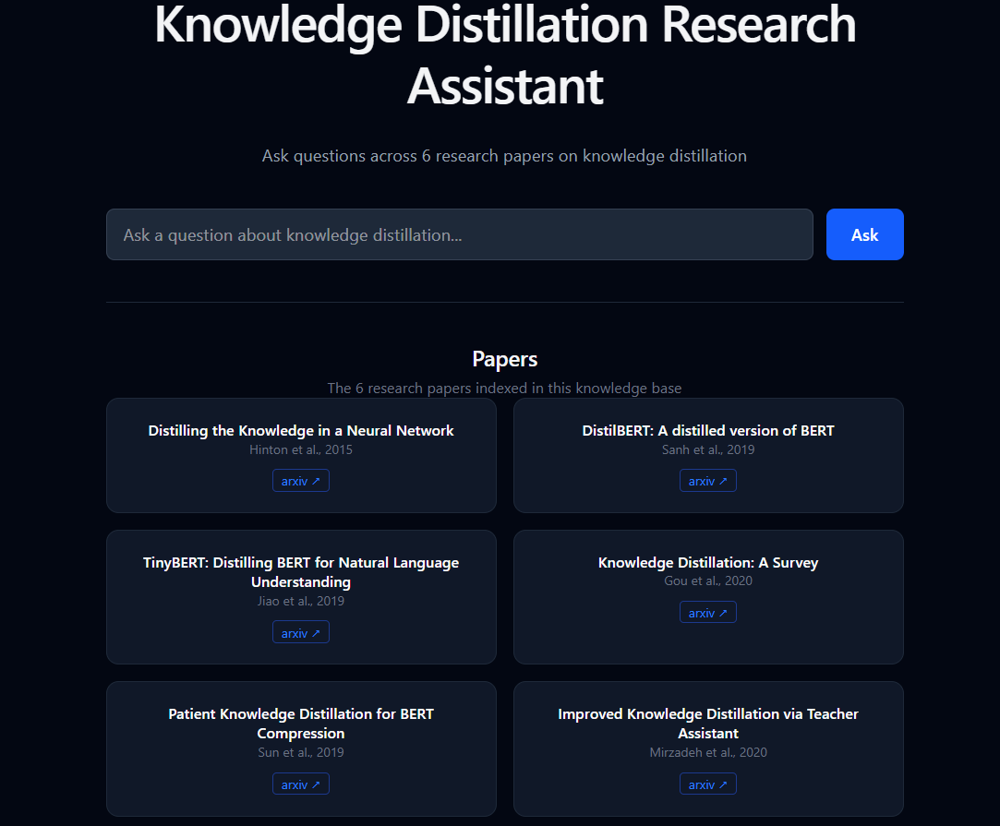

# Knowledge Distillation Research Assistant

A RAG-based Q&A system for querying and synthesizing knowledge across 6 foundational knowledge distillation research papers.

> 

---

## Features

- Multi-document RAG across 6 research papers
- Diversity-aware retrieval — pulls the most relevant chunk from each paper per query
- Source citations with page numbers in every answer
- Sub-1.1s response time powered by Groq
- Paper filter to scope queries to a specific paper
- Clean React frontend with dark theme

---

## Tech Stack

| Layer | Technology |
|---|---|
| Backend API | FastAPI |
| Vector Store | ChromaDB |
| Embeddings | sentence-transformers (`all-MiniLM-L6-v2`) |
| Document Pipelines | LangChain |
| LLM | Groq — Llama 3.3 70B |
| Frontend | React + Vite |
| Styling | Tailwind CSS v4 |
| AI Coding Assistant | Claude Code — used for boilerplate and project scaffolding |

---

## Monitoring

The backend exposes a `/metrics` endpoint compatible with Prometheus for real-time observability.

Tracks:

- Total query count per endpoint
- Request latency (response time in seconds)
- HTTP status codes per handler

Access metrics at: `http://localhost:8000/metrics`

---

## Papers Indexed

| Paper | Link |
|---|---|
| Hinton et al., 2015 — Distilling the Knowledge in a Neural Network | https://arxiv.org/abs/1503.02531 |
| DistilBERT: A distilled version of BERT | https://arxiv.org/abs/1910.01108 |
| TinyBERT: Distilling BERT for Natural Language Understanding | https://arxiv.org/abs/1909.10351 |
| Knowledge Distillation: A Survey | https://arxiv.org/abs/2006.05525 |
| Patient Knowledge Distillation for BERT Compression | https://arxiv.org/abs/1908.09355 |
| Improved Knowledge Distillation via Teacher Assistant | https://arxiv.org/abs/1902.03393 |

---

## Getting Started

### Prerequisites

- Python 3.9+
- Node.js 18+
- A [Groq API key](https://console.groq.com)

### 1. Clone the repo

```bash
git clone <your-repo-url>
cd "RAG Project"
```

### 2. Set up the backend

```bash
cd backend
pip install -r ../requirements.txt
```

Add your Groq API key to the `.env` file in the project root:

```
GROQ_API_KEY=your_groq_api_key_here
```

### 3. Ingest the papers

Place your PDF files in `backend/docs/` — filenames must match the paper keys used in `retriever.py`:

```
hinton_kd.pdf
distilbert.pdf
tinybert.pdf
kd_survey.pdf
patient_kd.pdf
teacher_assistant_kd.pdf
```

Then run the ingestion script:

```bash
cd backend
python ingest.py
```

### 4. Start the backend

```bash
cd backend
uvicorn main:app --reload
```

The API will be available at `http://localhost:8000`. Verify with:

```bash
curl http://localhost:8000/health
# {"status": "ok"}
```

### 5. Start the frontend

```bash
cd frontend
npm install
npm run dev
```

Open `http://localhost:5174` in your browser.
